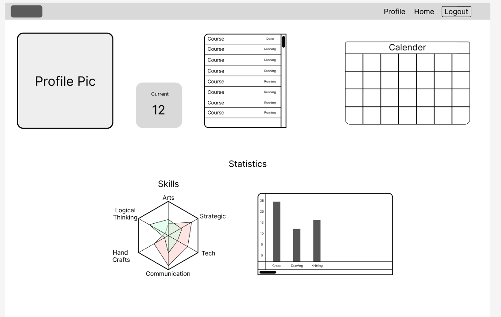

# Hiwayati

## [Hiwayati-Frontend]() [Hiwayati-Backend](https://github.com/0yousif/Hiwayati-backend)

[Yousif](https://github.com/0yousif) |
[Jawad](https://github.com/Jawad-Hassan-J) |
[Hussain](https://github.com/Hussain-Bader)

## Description

### Our project is a full-stack application. The idea behind this app is to create a bridge between providers who offer programs and participants who need help with a specific course. In our platform, each course has a live chat so participants and providers can communicate easily. We also provide visual statistics to show each participant’s progress, making it easier to track learning and improvements.

# Getting Started

On the home page , the participants will see the recommended courses based on the skills,
aftre click in enroll(More for course page that show details of course), the page will move to the profile that show the details of the participants and calendar that show events, on the course page that show details of course and chat with pepole on the same course.

## Technologies Used

- **MERN Stack** – Combination of MongoDB, Express, React, and Node for full-stack development
- **React** – Frontend UI library for building interactive interfaces
- **React Calendar** – Calendar component for scheduling and date selection
- **CSS** – Styling and layout design
- **Node.js** – JavaScript runtime environment for backend services
- **Express.js** – Backend framework for handling routes and APIs
- **MongoDB** – NoSQL database for storing application data
- **RESTful APIs** – Communication between frontend and backend
- **WebSockets** – Real-time communication for features like live chat
- **Chart.js** – Library for showing visual statistics and charts

## Screenshot

Screenshot for the application

### Home Page

### Here, participants can see recommended courses based on the skills they have. When they click **Enroll**, the course will be added to their profile. Clicking **More** opens the course information and the live chat, where everyone in the course can communicate easily.

### Profile Page

### The profile page changes based on the user’s role. Each role has different information to display, like a dashboard. For a regular user, it shows a calendar with all events in the agenda and a list of all courses (current and previous). There is also a box showing the exact number of courses, and statistics showing details about each course and the hours spent on it.

### Course Page

### The course page contains all the important information about the course, including its name, description, location, and the instructor. It also shows the skills you will gain after completing the course. An interesting feature here is the live chat, where everyone enrolled in the course can communicate with other members in real time.

## The diagram below explains the structure of the database

## Database Structure (ERD)

Our database connects **teachers**, **providers**, and **participants** through courses, skills, and sessions.

- **Teacher** – Stores teacher details like username, password, image, bio, courses they teach, and their schedule.
- **Participant** – Contains participant details such as username, password, age, image, current and previous courses, schedule, and skills.
- **Provider** – Holds provider information including name, location, and the courses they offer.
- **Course** – The main link between teachers, providers, skills, and participants. Each course has a name, image, description, price, skills covered, and messages.
- **Skill** – Describes a skill with its name, description, and the courses that teach it.
- **Session** – Represents a specific class or meeting, with details like name, description, time, date, course ID, and place ID.

This design allows:

- Providers to offer multiple courses.
- Teachers to teach multiple courses and sessions.
- Participants to join and track multiple courses.
- Skills to be linked to different courses.
- Sessions to be connected to a specific course and location.

## Component Tree

The component tree below shows how the application’s interface is structured:

- **App** – The main root component that holds the entire application.
- **Profile** – Displays user information.
- **Calendar** – Shows the user’s schedule and upcoming events.
- **Statistics** – Displays progress and data.
- **Skills** – Shows the skills the user is working on.
- **Hobby Hours** – Displays the time spent on hobbies.
- **Home Page** – The main landing page of the app.
- **Recommend For You** – Shows suggested hobbies or courses for the user.
- **Hobby** – Displays details about a specific hobby.
- **Hobbies** – Lists all hobbies available.
- **Chat** – Real-time messaging between users.
- **Participants** – Shows people involved in a hobby or course.
- **Details** – Shows full details about the hobby.
- **Skills** – Lists skills related to the hobby.
- **Navbar** – The navigation bar for moving between sections of the app.

## **Credits**

### special thanks to instructor who was available and guided me and my team whenever we needed help.

- Michael Lackey [GitHub](https://www.linkedin.com/in/michaelglackey/) [Linkedin](https://www.linkedin.com/in/michaelglackey/)
- Zainab Mohamed [GitHub](https://github.com/zeemohamed7) [Linkedin](https://www.linkedin.com/in/zainabmo/)
- Saad Khan [GitHub](https://github.com/saadkhan29)
- Kalil Khunji [Github](https://github.com/KhalilKhunji)
- task management in [Notion](https://github.com/0yousif/Hiwayati-backend).

# Authors

### Yousif

Email:  |
GitHub:  |
LinkedIn:

### Jawad

Email:  |
GitHub:  |
LinkedIn:

### Hssain

Email:  |
GitHub:  |
LinkedIn:

# Useful Resources

### Selected by Jawad

[BroCode Js Course](https://www.bing.com/videos/riverview/relatedvideo?q=brocode+js+course&mid=FA0ED7BCBBF658419A5CFA0ED7BCBBF658419A5C&FORM=VIRE) | [BroCode React Course](https://www.bing.com/videos/riverview/relatedvideo?q=brocode+react+course&mid=4E30B02B13C6F3083A6C4E30B02B13C6F3083A6C&FORM=VIRE) | [BroCode MongoDB Course](https://www.bing.com/videos/riverview/relatedvideo?q=brocode+mongoDb&mid=F8393F6A7EB757830ECEF8393F6A7EB757830ECE&FORM=VIRE)

[Object Tutorial MDN](https://developer.mozilla.org/en-US/docs/Web/JavaScript/Guide/Working_with_objects) | [Master JavaScript Objects](https://www.bing.com/videos/riverview/relatedvideo?&q=master+object+in+java+script&&mid=5502DF2BB1D550DEBF0A5502DF2BB1D550DEBF0A&&FORM=VRDGAR)[Populate](https://www.geeksforgeeks.org/mongodb/mongoose-populate-method/)

[Chart.js Tutorial](https://www.youtube.com/watch?v=XPOSEf40SkQ)
